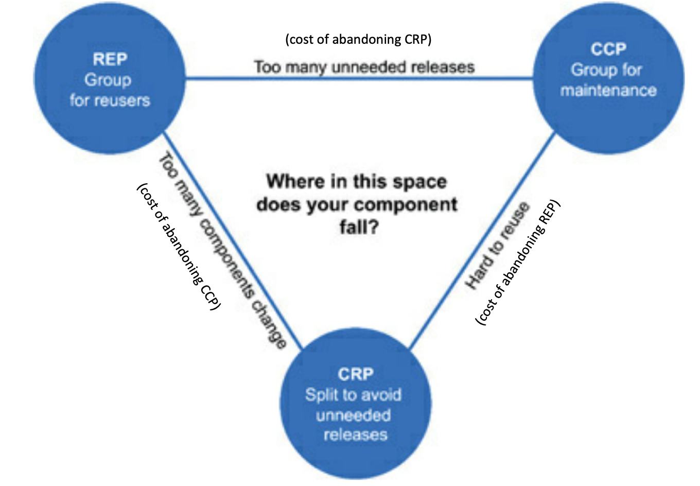

# Part IV - Component Principles

The [SOLID design principles in part III](part-3-design-principles.md)
showed us how to arrange code into classes / modules and how to
interconnect those classes.

Part IV will go one level up to show us what **components** are, how to
compose them and how they should interact in a system.

## Chapter 12 - What Components Are

Components are units of deployment. Jar files in Java, Gems in Ruby,
DLLs in .Net.

Good component design retains **independence of deployability and
independence of developability.**

## Chapter 13 - Component Cohesion Principles

Component cohesion is about answering the question: **Which classes
belong in which components?**. This is usually done in an ad-hoc manner,
but there are software engineering principles that can guide the
decision.

### The Reuse / Release Equivalence Principle (REP)

A component should be deployable **as a whole** and independent from
other components. The deployment of a component will therefore have a
*release number* (e.g. semantic version), withs its corresponding
*release documentation.* This allow developers that use our component to
decided if they want to upgrade the component or not.

Deciding which classes belong to which components gets clearer from the
optics of *releases:*

> Classes and modules that are grouped together into a component should
> be **releasable** together. The fact that they share the **same
> version number** and the **same release tracking**, and are included
> under the **same release documentation**, should *make sense* both to
> the author and to the users.

*"Should make sense"* is fuzzy advice. However, the next two principles
complement the REP to make it less fuzzy.

Detecting when the REP is violated is easy. Here are two symptoms:
- As a developer using a component (jar/gem), if upgrading the component
  forces me to do changes in multiple pieces of unrelated functionality,
  then the architecture of the component is violating the REP (i.e. the
  component is made up classes that don't *make sense together*).
- As a developer using a component, if I'm forced to upgrade the
  `authentication` component to get upgrades on the `avatar processing`
  functionality, then the component is not well designed (it violates
  the REP).

### The Common Closure Principle (CCP)

> Gather into components those classes that change for the same reasons
> and at the same times. Separate into different components those
> classes that change at different times and for different reasons.

This is the
[single responsibility principle](part-3-design-principles.md#chapter-7---the-single-responsibility-principle)
applied at the *component* level. Remember that *"reason for change"* is
related to the **actors** that depend on those components.

### The Common Reuse Principle (CRP)

As with the [REP](#the-reuse--release-equivalence-principle-rep) and the
[CCP](#the-common-closure-principle-ccp), the CRP also help us decide
which classes **shouldn't** be placed together into the same component.

When we code a component, the classes within that component will depend
on each other to do the overall work. Components will naturally have a
set of *inseparable classes* where **all classes** are needed for the
component to work. If there is a class that is not absolutely needed,
then it shouldn't belong in that component.

### The Tension Diagram For Component Cohesion

REP and CCP are *inclusive* principles that tend to make components
larger. The *CRP* is exclusive, driving components smaller.As a result,
there is an inherent tension in component design.

It is the job of the architect to decide where in this space the design
should be considering the *current* concerns of the development team and
to change the balance as the concerns change (the balance is dynamic as
projects mature).

