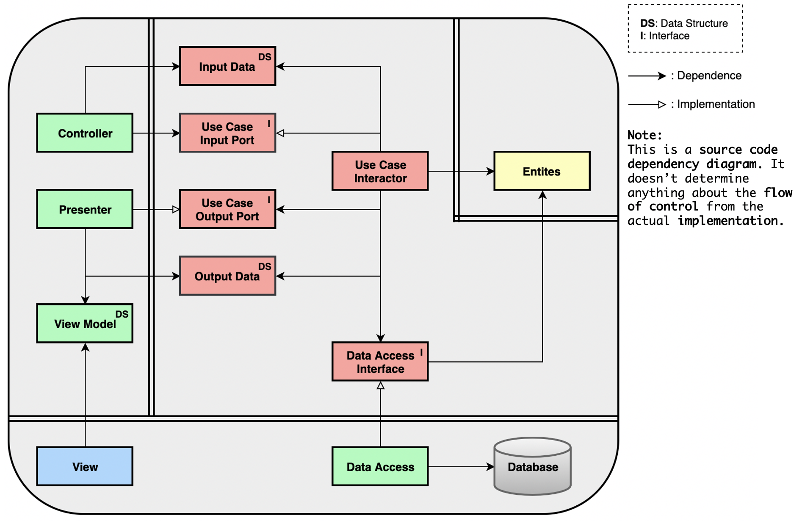
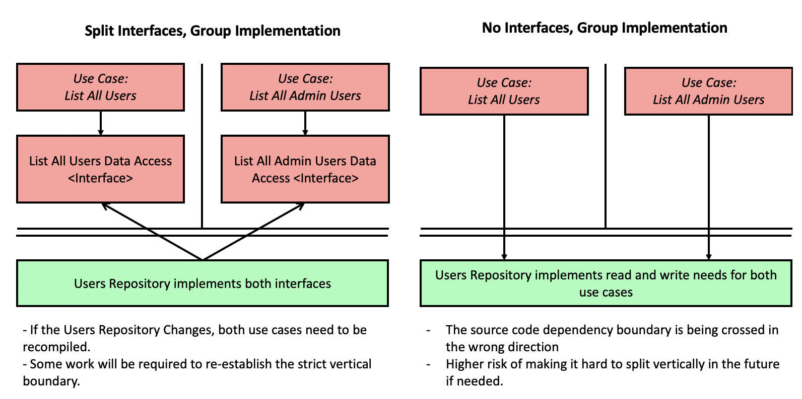
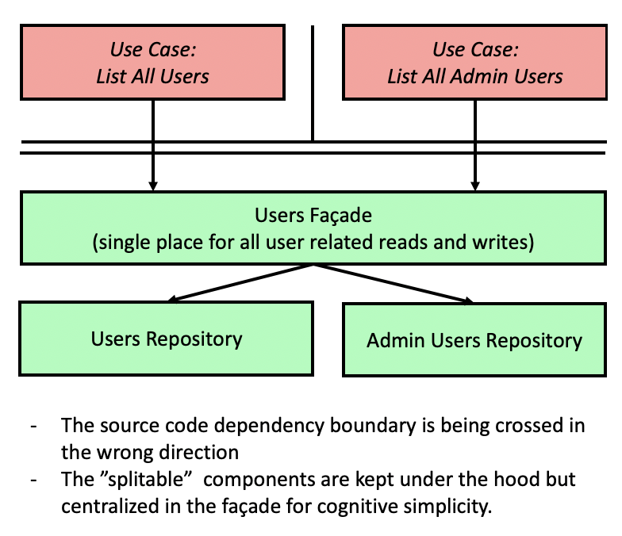

# Part V - 2 - Architecture

Note: this was divided into 2 files because it was getting too long.

## Chapter 22 - The Clean Architecture

Hexagonal Architecture (aka ports and adapters), DCI, BCE are all
architecture structures that have this commons set of characteristics
(they vary a little in their details):
- **Independent of frameworks**
- **Testable**: business rules are testable without the UI, the DB, the
  web server, and any other external element.
- **Independent of the UI:** The UI can change easily with no impact to
  the business rules. The UI can easily be replaced.
- **Independent of the database**
- **Independent of external agents:** The business rules don't know
  anything about interfaces to the outside world.

**The clean architecture** is an attempt at integrating all these
architectures in to a single actionable idea:


Next we will explore different aspects of this idea.

### Breakdown of the Clean Architecture

#### The Dependency Rule

> Source code dependencies must point only inward, toward higher-level
> policies.

- Nothing in an inner circle can know anything about something on an
  outer circle.
- Data formats declared in an outer circle should to be used by an inner
  circle (especially if those formats are generated by a framework in an
  outer circle).

#### Entities

> Entities encapsulate enterprise-wide application-independent Critical
> Business Rules. An entity can be an object with methods, or it can be
> a set of data structures and functions.

The are at the highest level. No operational changes to an application
(e.g. visual or security changes) should affect this layer.

- If you work in an enterprise with different applications, entities can
  be used by many different applications.
- If you are only working with a single app, entities are the business
  objects of the app.

#### Use Cases

They are *application-specific* business rules. We do expect certain
changes to the operation of the software (particularly on how it is
used) to cause changes in this layer.

They control the dance of the `Entities` and also use the `Data Access
Interfaces` to fetch the data used by those Entities into memory from
the `Database`. See the
[Use Cases (Application-specific Business Rules)](part-5-1-architecture.md#use-cases-application-specific-business-rules)
for more details.

#### Interface Adapters

They are responsible for converting data from the format most convenient
for the use cases and entities, **to the format most convenient for some
external agency such as the database or the web.**

##### UI Interface Adapters

This layer fully contains the UI-MVC: presenters, views-models and
controllers.

Interaction with the use cases:
- On the way into the use cases: controllers pass data into the use
  cases wrapped into some data structures whose interface is determined
  by the use case layer and implemented by the interface adapter layer.
- On the way out of the use cases: presenters wrap data returned by the
  use case and adapts it to the view.

##### DB Interface Adapters

Converts data from the form most convenient for entities and use cases,
to the form most convenient to whatever persistence mechanism is being
used (e.g. the database).

- Nothing inwards from this layer know about the database.
- If the database is relational, the SQL code is restricted to this
  layer.
- E.g. repositories go in this layer implementing an interface
  determined at the use case level.

##### External Service Interface Adapters

Similar than from the DB, this layer converts the data from the form
that is convenient to the external service, to the form that is
convenient to the use cases and entities.

#### Frameworks and Drivers

- Contains things like the actual database or the web framework.
- We dont generally write much code in this layer since most of the
  components are libraries.
- Perhaps the only code we need to write is some glue code to
  communicate to the circles inwards.

#### Can I use more than four layers?

Yes, you may find you need *more* layers for you software. The Clean
Architecture Layers are meant to be schematic. However, the *dependency
rule* still applies: higher-level things go on the inside and
dependencies should only point inwards.

#### Crossing Boundaries

The diagram above shows an example on how to cross the boundaries. Note
the usage of
[Dependency Inversion](part-3-design-principles.md#chapter-11---the-dependency-inversion-principle)
to ensure that source code dependencies always point to higher-level
layers. Also note that the source code dependency direction is
independent from the flow of control (aka flow of execution) direction.

##### Which Data Crosses the Boundaries

Data crosses boundaries in simple data structures. All of these forms
are acceptable:
- Structs.
- Simple data transfer objects (e.g. value objects).
- The data can simple be the arguments in function calls.
- Data packed into hashmaps (aka Ruby hashes).

The data should always be in the form that is most convenient for the
inner circle (higher-level layer).

Common violations of these are:
- Passing Entity objects (TODO: Clarify with some examples).
- Having the DB framework pass some sort of automated "row structure"
  created as a result of a query into the use case (e.g. pass in active
  record objects into the use cases).

### A web application example

The diagram below shows how the clean architecture could be used in the
context of a request response cycle of a database backed web
application.



Uncle Bob explains how this works clearly in the book:

> The Controller packages that data into a plain old Java object and
> passes this object through the InputBoundary to the UseCaseInteractor.
> The UseCaseInteractor interprets that data and uses it to control the
> dance of the Entities. It also uses the DataAccessInterface to bring
> the data used by those Entities into memory from the Database. Upon
> completion, the UseCaseInteractor gathers data from the Entities and
> constructs the OutputData as another plain old Java object. The
> OutputData is then passed through the OutputBoundary interface to the
> Presenter.
>
> The job of the Presenter is to repackage the OutputData into viewable
> form as the ViewModel, which is yet another plain old Java object. The
> ViewModel contains mostly Strings and flags that the View uses to
> display the data. Whereas the OutputData may contain Date objects, the
> Presenter will load the ViewModel with corresponding Strings already
> formatted properly for the user. The same is true of Currency objects
> or any other business-related data. Button and MenuItem names are
> placed in the ViewModel, as are flags that tell the View whether those
> Buttons and MenuItems should be gray.
>
> This leaves the View with almost nothing to do other than to move the
> data from the ViewModel into the HTML page.


Note that this example assumes that we want to maintain strict
architectural boundaries between the layers and therefore represents an
ideal case. In
[Chapter 24 - Partial Boundaries](#chapter-24---partial-boundaries),
Uncle Bob discusses the cost of maintaining strict boundaries and offers
some ways of introducing less strict boundaries that *could* become
strict if needed.

#### Sample Code

The code below contains a possible pseudo-code implementation of the
architecture above.Only the parts that can cause confusion are shown,
the others I think are fairly obvious.

Note that this code is only schematic. These are a couple of things to
consider when reading this code:
- The classes could be decoupled further by using dependency injection
  frameworks,
  [`Abstract Factories`](part-3-design-principles.md#abstract-factories)
  among other patterns. As with everything with software, whether you
  want to use these other techniques or not... **it depends** on your
  situation.
- The code below assumes that the `Presenter` is the entrypoint to all
  view-related logic and that it is capable of rendering the html
  templates. There are benefits to this approach. However, most web
  frameworks like Rails make the controller actions determine which html
  template needs to be rendered.
  - In this case, the controller code changes slightly. See
    [the discussion about option#1 and option#2 on this Stack Overflow post](https://softwareengineering.stackexchange.com/questions/357052/clean-architecture-use-case-containing-the-presenter-or-returning-data)
    for more information about these approaches.
- The names of the classes were selected to match the diagram. In a real
  application, this names will match concepts from the domain.

##### The Controller Action

```java
public void controllerAction(Params params) {
    // Typically pre-configured and injected into the controller
    // Shown here for clarity
    Presenter presenter = new Presenter();
    Repository repository = new Repository();    
    UseCase useCase = new UseCase(presenter, repository);

    InputData inputData = new InputData(name: params.name, email: params.email);
    // This assumes that the injected presenter takes care of rendering 
    the view.
    useCase.doSomething(inputData); // Usage of the input port
} 
```

##### The Use Case and the Use Case Input and Output Ports

```java
interface UseCaseInputPort {
    public void doSomething(InputData inputData);
}
```

```java
interface UseCaseOutputPort {
    public void present(OutputData outputData);
}
```

```java
class UseCase implements UseCaseInputPort {
    private Repository repository;
    private Presenter presenter;

    public UseCase(Repository repository, Presenter presenter) {
        this.repository = repository; // Implements Data Access Interface
        this.presenter = presenter;
    }

    // Use Case Input Port
    public void doSomething() {
        Data data = this.repository.getData();
        Entity entity = new Entity(data);
        Integer someResult = entity.someBusinessRule();
        OutputData outputData = new OutputDAta(someResult);
        // #present is the Use Case Output Port 
        this.presenter.present(outputData);  
    }
}
```

##### The Presenter and The View Model

```java
class Presenter implements UseCaseOutputPort {
    public void present(OutputData outputData) {
       String formattedDate = formatDate(outputData.date());
       // ... other formatting
       ViewModel viewModel = new ViewModel(date: formattedDate);
       render 'some/template', viewModel
    }
    
    private String formatDate(Date date) {
        // ... formatting
    }
}
```

```java
class ViewModel {
    public ViewModel(OutputData outputData) { 
        // basically holds strings and booleans flags 
    }
}
```

## Chapter 23 - Presenters and Humble Objects

### The Humble Object Pattern

This pattern helps us identify and protect architectural boundaries. The
Clean architecture extensively uses the *Humble object pattern* to do
just this.

Starting with code that is very hard to test (like a GUI), the pattern
makes the thing that is hard to test as dumb as possible (i.e. *humble*)
by pulling out things that are easy to test into a separate class.

For example, a GUI can be split into a *presenter* and a *view* (a form
of *Humble object*) that is very dumb. This makes it very easy to test
all the GUI content via the presenter without actually having to render
the GUI. The view is so dumb that it is not even tested automatically.

### More on Presenters and View Models and Views

`Presenters` format everything and dump the result of that formatting
into a `View Model` data structure that contains Strings, boolean flags
and enums.

These are some things that the `Presenter` places into the `View Model`:
stringified dates, stringified currencies, currency color, labels for
buttons, if buttons should be disabled or not, menu items, names for
every radio button, check box and text fields, tables, etc...

The `View` **only** loads data from the view model.

**Note:** in practice, this seems very hard and impractical to implement
without library assistance. It would require some `Presenter-View
Model-View` library to help reduce the amount of boilerplate code that
this will create.


### Where do Data Mappers and ORMs go?

They go in the **Database Gateway** layer and are in service of
implementing the `Data Access Interface` required by the **Use Case**.
Only a dumb data structure whose format is defined by the use case layer
crosses the boundary. Needles to say, this data structure object does
not carry any further connection to the database.

### Where do calls to external services go?

They follow a similar structure to **Database Gateways.**


## Chapter 24 - Partial Boundaries

Fully-fledged strict architectural boundaries result the creation of a
lot of `interfaces` and `data structure` classes to maintain. Sometimes,
this can be judged as too complex (over-engineered) or too expensive to
build in light of the specifics of the project.

For those cases, we might want to introduce a **Partial Boundary**. A
partial boundary allows us to reduce the complexity (in terms of number
of files) but ideally still leaves room to upgrade to a strict boundary
if needed.

Note that all partial boundaries are open to degradation if developers
are not disciplined. Therefore, there might be some work required to
upgrade it to a strict boundary.

Uncle Bob offers 3 examples of how to introduce partial boundaries.
There are many more ways.

### Partial Boundary 1: Use Source Level Decoupling Mode

Of the 3 techniques offered, this is the one that compromises the least
in terms of boundary strictness.

It is basically doing all the coding work to achieve true
[Source Level Decoupling](part-5-1-architecture.md#decoupling-modes) but
not taking the step into
[Deployment Level Decoupling](part-5-1-architecture.md#decoupling-modes).

Source Level decoupling is significantly cheaper than deployment level
because there is no multi-package version tracking or release / build
management burden.

However, since the code is still in the same project, it is easy for
developers to weaken the boundary by making source code imports that
cross the boundaries in the wrong direction.

### Partial Boundary 2: Group Service Interfaces or Implementations

This is better explained through an example. Imagine we are implementing
a `ListAllUsers` use case.

In a strict implementation that separates both vertical and horizontal
layers, we would declare a `ListAllUsersDataAccessInterface` that
requires the implementation of `#listUsers`. In turn, we would create a
`ListAllUsersRepo` that implements `ListAllUsersDataAccessInterface` and
actually makes the query to the DB. So far we have 3 files.

Now imagine we also want to create the `ListAllAdminUsers` use case. In
a strict implementation, this will result in another interface and
another repository files to be created.

We now have 6 files in total (not counting tests). This is perfect
vertical separation, but a lot of code to maintain.

We could reduce the number of files by for example keeping the interface
declaration separate but declaring a single `UsersRepository` that
implements all interfaces.

Vertical separation is lost and moving into deployment level decoupling
is no longer immediately possible. However, it shouldn't be too hard to
refactor out back into vertical slices if needed.

We can reduce the file number even more by avoiding the interfaces
altogether. However, the compromises here are larger and the risk of
losing control of the boundary is also higher.




### Partial Boundary 3: Reduce Cognitive Load Introducing a Facade

In Part III, we saw how
[Facades](part-3-design-principles.md#approach-2-use-class-as-facade)
can be used to reduce the cognitive load of having to deal with many
small classes.

The next diagram shows that pattern can be used to introduce a partial
boundary. It also comes with the compromise of boundaries being crossed
in the wrong direction and risk of losing control of the boundary.


