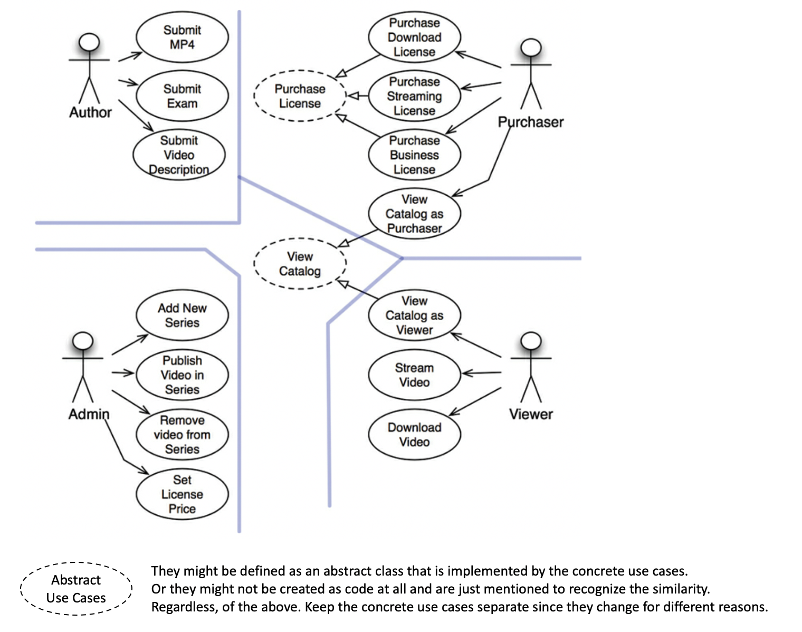
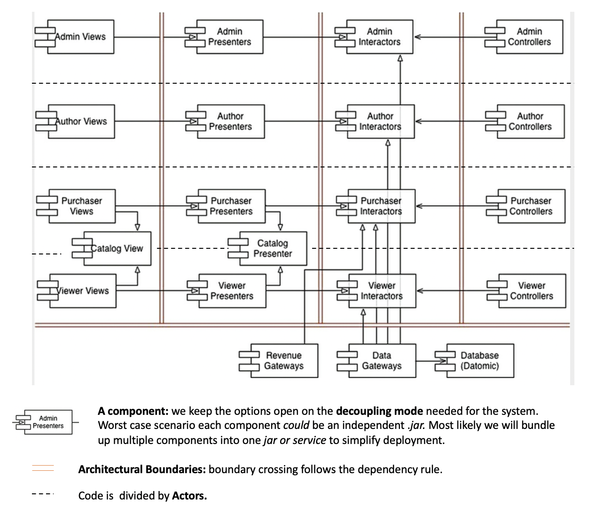
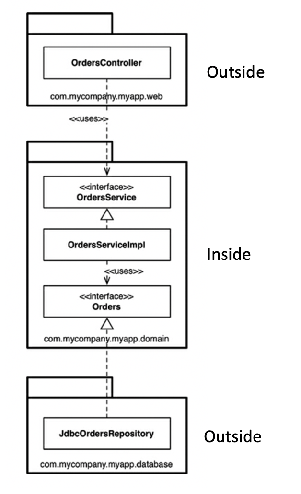
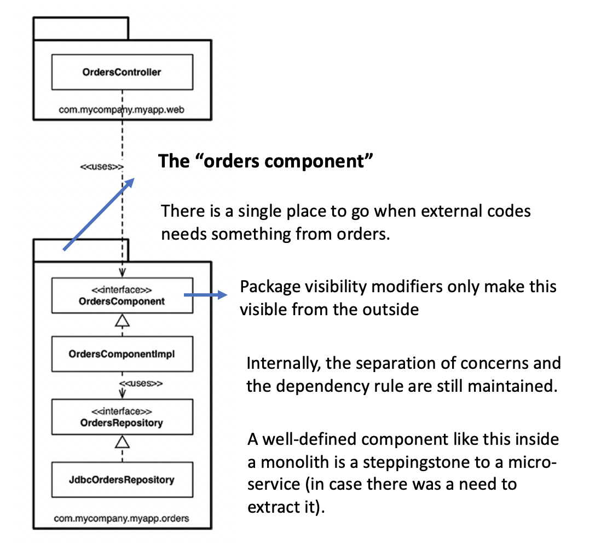
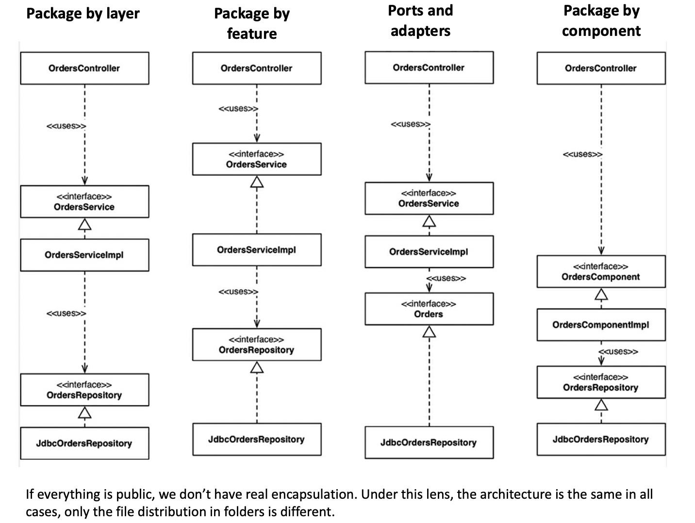
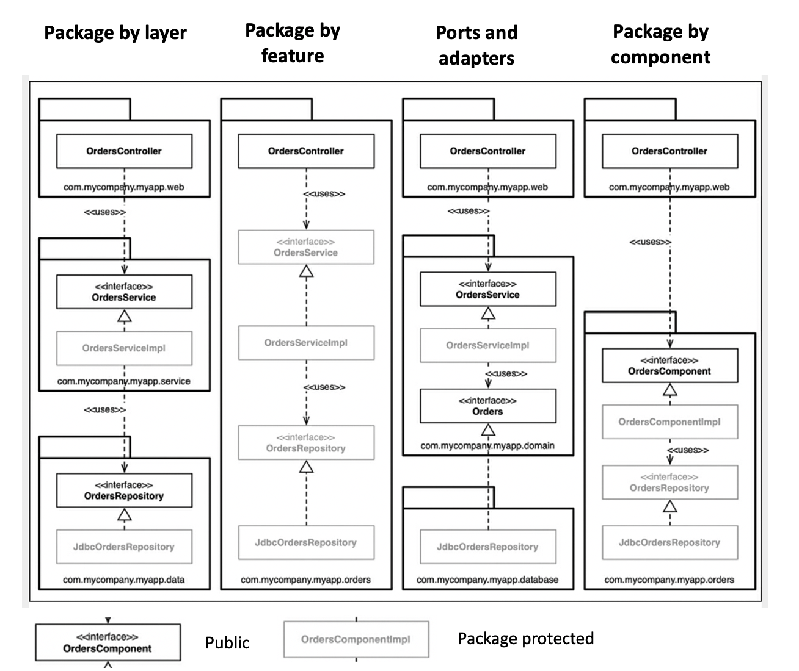

# Part VI - Details

## Chapter 30 - The Database is a detail

The *data model* **is** highly significant to your architecture and most
likely is part of your **entities**. However, the *database tool* to
access your data is a low level detail that is **not** an architectural
element.

### Relational Databases

Relational databases are elegant and mathematically sound technology.
However, while relational tables represent a convenient form of data
storage and access, there is nothing architecturally significant about
arranging data in rows within tables.

- Your use cases should not know or care about the way data is stored.
- Knowledge of the tabular structure should be restricted to the data
  access (aka gateways) layer of the
  [clean architecture](part-5-2-architecture.md#chapter-22---the-clean-architecture).
- Many frameworks allow database rows and tables to be passed around the
  system. This is an architectural error that couples use cases,
  business rules and even the UI to the structure of the data.
- Your use cases should depend on your **data model**, which most likely
  is a set of rich objects or data structures like linked lists, trees,
  hash tables, queues, etc. We almost always map the tabular data into
  other data structures and very rarely work with rows and tables
  directly on our use cases or business rules.

### What about performance?

Performance is architecturally significant, but it can be entirely
encapsulated and separated from the business rules. Getting data in an
out of the data store quickly should be handled outside of the business
rules in the lower level data access mechanisms.

## Chapter 31 - The Web is a detail

It has a long history of pendulum swings from centralizing computing
power (e.g. server rendered pages), to distributing it (e.g. front end
apps) and back. **As architects, we want to shield our business form
those swings and be able to adapt to the swings.**

The philosophical bottom line is **the GUI is a detail and the web is a
GUI.** The web is nothing more than an IO device and hence we should try
to isolate it from our business logic.

The practical bottom line is that with ultra-rich web UIs that
constantly communicate with the servers, aiming for full device
independence in all interactions might be unpractical.

A more practical approach is to reason about the interactions between
the GUI and the application as if they were divided into two types:
- Small and constant interactions that happen to build up and **complete
  the set of inputs** required to run a use case (e.g. drag and drops to
  sort things, async loading of drop down data, autocompletes)
- Business critical interactions that happen when the **complete input
  data is sent to a use case**, the use cases processes the data and
  returns an output to the GUI.

Trying to achieve device independence for the first type of interactions
is probably unpractical and not business critical. On the other hand, it
is easier to do so for the second type and luckily our precious business
logic (use cases) can be separated from the GUI in this case.

## Chapter 32 - Frameworks are details

Frameworks are powerful and useful; but they are not architectures.

Use frameworks but try not to marry them. If you marry into a framework,
make sure that it is a conscious decision and that the team understands
that it will be part of you application forever (until you re-write it).

### An asymmetric marriage

You relationships with frameworks is asymmetric in nature: as engineers
we make an enormous commitment to them by coupling our business logic to
the framework. But, the framework maintainers don't know us and probably
won't steer the framework to solve our problems if problems happen.

#### The risks of marrying into a framework

- Frameworks architecture is often not very clean and tend to violate
  the dependency rule. Your project should follow the structure that
  your code needs, not the one the framework needs.
- Frameworks often require you to tightly couple your business logic
  code to them by subclassing or mixing in framework classes or modules
  into your `Entities` and `Use Cases`. Once you do that, the framework
  is not coming back out of your app.
- The framework might help you with early development of features. But
  once your product matures and outgrows the framework, you will start
  fighting it.
- The framework might evolve into a direction that you don't find
  useful, it might get abandoned or you might want to switch. Once you
  couple to it, you are stuck upgrading to new versions even if you
  don't need them.

### Use frameworks but do not marry them

Treat frameworks as details and limit its use to the outer layers of the
[clean architecture.](part-5-2-architecture.md#chapter-22---the-clean-architecture)
That is, don't let them into your `Use Cases` or `Entities`.

If you *need* to let them in, don't derive a framework class, derive a
proxy instead that you control and that acts as a *plugin* to the
business rules.

### Unavoidable marriages

There are things you will need to marry. Just make sure it is *decision*
and you understand the extend of the commitment. For example, you will
need to mary the standard library for any programming language you use.

## Chapter 33 - Case Study: Video Sales

A case study that shows how to apply architectural thinking to an
application.

### Step 1: Use Case Analysis: Identify the actors and their use cases

- Each
  [actor](part-3-design-principles.md#chapter-7---the-single-responsibility-principle)
  represents a group of people that will drive changes into the system
  (they are reasons why the systems needs to change).
- Partition the system such that changes for one actor does not impact
  other actors.

### Step 2: Create a Preliminary Component Architecture

Note that in this case, the `Gateways` are not divided by use case,
meaning that this architecture does not follow the strict
[vertical and horizontal layer division](part-5-1-architecture.md#thinking-in-layers)
presented before.

This an example of a
[partial boundary](part-5-2-architecture.md#partial-boundary-2-group-service-interfaces-or-implementations)
trade-off, made to reduce the project complexity. Note that the rest of
the components do maintain vertical and horizontal layering and that the
compromise was made on one of the outer layers (not on the use cases or
entities).

### Step 3: Verify the Dependency Management

Make sure your preliminary design follows the
[Dependency Rule](part-5-2-architecture.md#the-dependency-rule):
- Arrows point towards the higher-level components.
- All arrows cross boundaries in the same direction.

## Chapter 34 - The missing chapter

> Written by Simon Brown

All the advice so far will make you a better engineer. But, the devil is
in the details, so lets take some time to see how some of this ideas are
implemented.

### Clean architecture aside, how do people organize code?

#### Strategy 1: Package by layer

- Separate code by what it does form the technical perspective, for
  example `models`, `views` and `controllers`.
- This is a horizontal-only layering approach. Ideally layers only
  depend on the next adjacent layer.
- In Java, layers are often implemented as packages.
- **Pros:** simple way to get started. Easy to understand.
- **Cons:**
  - As software becomes more complex, the pre-established amount of
    layers is not sufficient. Not all features require all layers.
  - The project structure does not
    [scream](part-5-1-architecture.md#chapter-21---screaming-architecture)
    what the project does.
  - It is easy for developers to "skip a layer" and still maintain the
    rule of "all dependencies should point downward". For example, a
    controller may import a repository directly skipping the
    interactors. "Skipping a layer" can quickly degrade into big balls
    of mud.

#### Strategy 2: Package by feature

- Vertical slicing based on related features, domain concepts or
  aggregate roots.
- In Java, this often means that all the code for a vertical slice is
  placed in a single package.
- **Pros:**
  - The project structure screams architecture.
  - It is easier to find all the code you need to touch if a use case /
    feature changes, since all is grouped together.
- **Cons:**
  - It is often considered a step up from "package by feature", but both
    are sub-optimal. We can do better.

#### Strategy 3: Ports and adapters

- Architectures like "ports and adapters", "hexagonal architecture",
  "boundaries, controllers, entities" all have this organisation
  strategy.
- Roughly speaking, all bits of code on a project can be categorized as
  being "inside" if they are part of the domain business rules, or
  "outside" if the are infrastructure or details.
- Things "inside" are independent from technical implementation details
  such as frameworks and databases.
- Things "outside" depend on things "inside", not the other way around.
- An example of packaging in java is shown next.
- **Pros:**
  - Good encapsulation that naturally follows the
    [horizontal and vertical](part-5-1-architecture.md#thinking-in-layers)
    layering.
- **Cons:**
  - Will lead to a large number of packages.
  - It is still technically possible for the `OrdersController` to
    import the `Orders<I>` skipping the `OrdersService<I>` (more on this
    on the next section).

#### Strategy 4: Simon Brown's Package by Component

This is Simon Brown's preference on how to organize code It uses a
slightly different definition of "component" than Uncle Bob's.
- For Uncle Bob, a "component" is a fine grained grouping of
  functionality that, if needed *could* be packaged into a single jar
  file each. The *actual* division of components into packages is not
  prescribed by Uncle Bob and left up to the engineers to figure out
  what makes sense for their application (although he gives some
  pointers
  [here](part-5-1-architecture.md#uncle-bobs-preferred-decoupling-mode-strategy)).
  See
  [the preliminary component architecture above](#step-2-create-a-preliminary-component-architecture)
  fo an example of what he means by components.
- For Simon, "components" are coarser and the concept is much more
  related to an actual suggested Java package division strategy for code
  organisation an the usage of **package visibility modifiers** to
  **enforce the architecture and encapsulation.**

Simon's "package by component" does not contradict the ideas from Clean
Architecture. His idea represent a practical implementation of how to
divide code into Java packages.

The problems he is trying to solve are:
- In the "package by layer", "package by feature" and "ports and
  adapters" packaging strategies there is nothing stopping a developer
  from "skipping a layer" and doing something like importing the
  `OrdersRepository<I>` in the `OrdersController`.
- To avoid problems like this to happen, teams often rely on discipline
  (but we know how that goes) or extra static analysis tools to detect
  when the intended architecture has been violated. He argues that the
  best approach to enforce this architectural principle is via the
  compiler.
  - Static analysis tools work, but sometimes extend the feedback cycle
    too much.

The next image illustrates Simon's "package by component" strategy.

##### Trade-offs

Compared to "ports and adapters", trade-offs a little bit of the
strictness in the
[horizontal](part-5-1-architecture.md#thinking-in-layers) layering for
having less packages and making it impossible to import the wrong thing
from the `OrdersController`.
- Less packages = easier to understand and deploy. All the code needed
  to make the `OrdersComponent` work travels together.
- Cheat-proof: It is impossible to import the `OrdersRepository<I>` from
  the controller.
- Swapping with arbitrary implementations of the `OrdersRepository<I>`
  is no longer possible, although the code still maintains the proper
  separation of concerns internally, so it shouldn't be hard.

#### More on the strategies: Organization VS Encapsulation

This section extends the previous adding a new optic: the usage of
package visibility modifiers.

Using packages to organize code and not using the visibility modifiers
to only make public what strictly needs to be public is equivalent to
just packages as folders to organize code.

In the scenario where everything is public there is no real
encapsulation difference between the "package by layer", "package by
feature", "ports and adapters" and "packaged by component" strategies.
Sure, the code organisation might *look* a little different but the
encapsulation is non-existent and the compiler does not help you to
enforce the architecture.

When package visibility is used to limit what is `public`, it becomes
clearer that different "package by X" strategies provide different
levels of architecture enforcement via the compiler.

- "*Package by layer*": it is possible for the `OrdersController`
  package to import the `OrdersRepository<Interface>`, breaking the
  architecture.
- "*Package by feature*": the `OrdersController` is the **only**
  entrypoint into the orders functionality. This may or may not be
  desirable. For example, if we want to have a `WebOrdersController` and
  a `MobileOrdersController`, then this packaging strategy does not
  work.
- "*Ports and adapters*": has sound vertical and horizontal layering. It
  is still technically possible for the `OrdersController` to import the
  `Orders<I>` skipping the `OrdersService<I>`.
- "*Package by component*": has sound encapsulation and the compiler can
  help us enforce the architecture. It is impossible for anything
  outside to directly import the `OrdersRepository<I>`. The compiler
  enforces this architectural principle.

#### Bottom line on the strategies

"Ports and adapter" and "package by components" are the most sound
strategies of the ones presented. There are pros and cons of each.

**"Ports and adapters"** has stricter horizontal and vertical layering.
However, with more packages comes more build complexity. It, also leaves
open the possibility for code in the "outside" to import other code
"outside", like a controller importing a "repository". This is not what
we want architecturally and the compiler cannot help us.

**"Package by component"** avoid the "outside code importing outside
code" problem and uses the compiler to enforce that. It also reduces the
number of packages to deal with. However, it has slightly weaker
horizontal layering because the repositories get packaged together with
the business logic objects.
- Note that internally, the separation of concerns is still very much
  respected.

#### Final note

**All of the above refers to the organization withing a single
(monolithic) applications.** However, if using micro-services, the same
principles can apply to the code organisation within the service.
